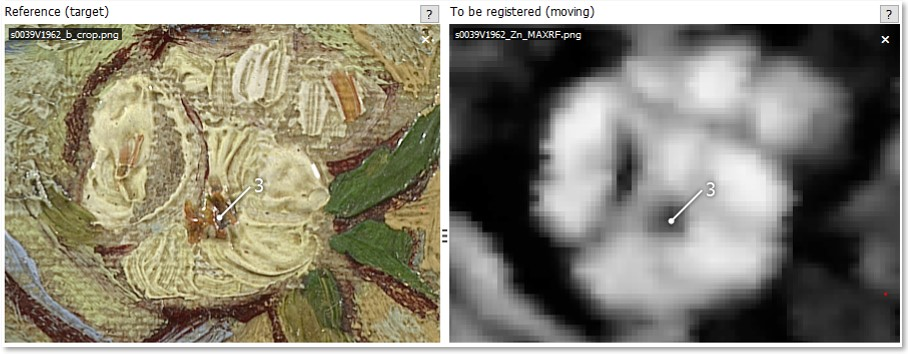
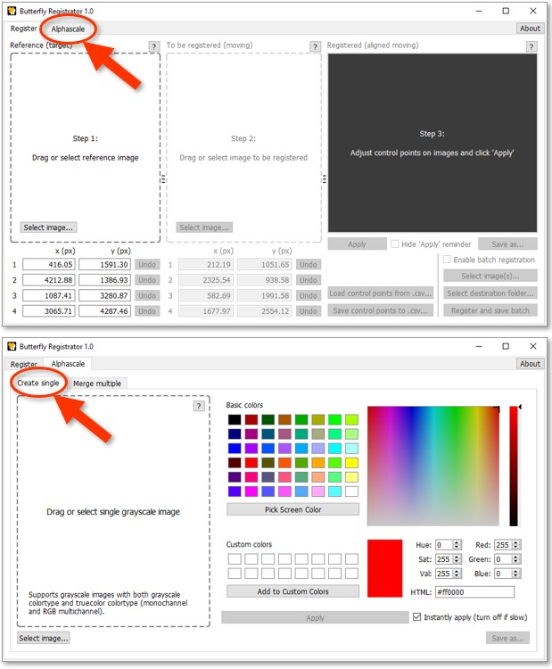

<p align="center">
  <big>
    <a href="#download-and-install">Download</a> 
    ·
    <a href="#tutorial">Tutorial</a>
    ·
    <a href="https://github.com/olive-groves/butterfly_registrator">GitHub↗</a>
    <br>
    <a href="https://github.com/olive-groves/butterfly_viewer">Butterfly Viewer↗</a>
  </big>
</p>

<p align="center">
  
  <br />
  <i>Registering an XRF element map to a color image¹</i>
</p>

<p align="center">
  
  <br />
  <i>Alphascale conversion of grayscale XRF element maps¹, then shown in <a href="https://olive-groves.github.io/butterfly_viewer/butterfly_viewer.html">Butterfly Viewer</a></i>
</p>

Butterfly Registrator is a preprocessing app for aligning images using pairs of control points you click and drag. It helps you align (or [*register*](#how-does-registration-work)) images to a given reference such that their heights and widths match and the features within those images line up, making it easy to later overlay and compare them without the hassle of manually zooming, stretching, and cropping them beforehand.

The Registrator also creates alphascale images. You can convert individual grayscale images using a color picker and also merge multiple alphascale images into a single image.

The Registrator runs as an [installable Windows executable](#windows-executable) or directly on its [Python source code](#python).

Most types of PNG, JPEG, and TIFF can be loaded into the Registrator. It can likewise save registered image files to PNG, JPEG, and TIFF.

With [Butterfly Viewer<sup>↗</sup>](https://olive-groves.github.io/butterfly_viewer/butterfly_viewer.html) you can rapidly compare your registered images with sliding overlays and synchronized side-by-side pan and zoom. The Viewer is handy for visually inspecting painting research data such as high-res and raking-light photos, X-rays, and element maps from XRF and RIS — especially with element maps [converted to alphascale](#convert-to-alphascale-from-grayscale).

### Key features

- **Side-by-side image previews** to rapidly check the accuracy of registration and make adjustments before saving a copy.

- **Batch mode** to apply the same registration to multiple images of the same capture/perspective, which is useful for registering element maps from scanning X-ray fluorescence (XRF) and reflectance imaging spectroscopy (RIS) to a ground truth like a color photograph.

- **Save registration control points to CSV** to easily document and trace the images you register, and import later if you want to reproduce or adjust a registration.

<sup>¹*Small Pear Tree in Blossom* by Vincent van Gogh (Van Gogh Museum, Amsterdam)</sup>

# Download and install

You can download and install Butterfly Registrator to run:
- as a [Windows executable](#windows-executable); or 
- directly with [Python](#python).

## Windows executable

> Download: [`butterfly_registrator_v1.y.z_win64_setup.exe.zip`<sup>↗</sup>](https://github.com/olive-groves/butterfly_registrator/releases/latest)
>
> <sup> **Restart recommended** · **230 MB installed**</sup>

For Windows, Butterfly Registrator installs to your computer with an executable (.exe) installer similar to how other programs install on your computer. The Registrator will be added to your list of programs and optionally to your desktop as a shortcut.

Here v1.0.0 is shown in the screenshots, but you should use the [latest version](https://github.com/olive-groves/butterfly_registrator/releases/latest) unless advised otherwise.


### Prerequisites

- The Registrator executable only runs on Windows. There's currently no support for executables for Linux or macOS.

- The Registrator uses 230 MB of storage space as an installed app.

- The Registrator uses locally stored images (like PNG, JPEG, TIFF) to load for registration and alphascale creation. It's designed to be navigated by mouse or trackpad by clicking, dragging, and dropping.

- The Registrator doesn't use the internet, so any online images you wish to use must be locally available — for example, by downloading them or by selecting “always keep on your device” if they sync to cloud storage like OneDrive or Google Drive. Images on network shares can be loaded into the Registrator, but they can take more time to load than those stored locally, especially if accessing the share through a VPN.

### Download ZIP

Download the Registrator from the latest release of the Registrator's GitHub repo, which is packaged as an installer under *Assets* as [`butterfly_registrator_v1.y.z_win64_setup.exe.zip`<sup>↗</sup>](https://github.com/olive-groves/butterfly_registrator/releases/latest).


<br>
<sup>Here v1.0.0 is shown, but you should download the [latest version](https://github.com/olive-groves/butterfly_registrator/releases/latest).</sup>

### Extract ZIP

Extract `butterfly_registrator_v1.y.z_win64_setup.exe` from the ZIP:

1. Go to the folder where you downloaded the ZIP.
2. Right-click the ZIP.
3. Select **Extract All...** or another extraction tool (like 7-Zip).


### Run installer

**Heads-up:** Your computer might block you from running the installer via double-click if you’re using a work computer or otherwise don’t have admin privileges:

- If you have no admin privileges, skip to [Option 2](#option-2-without-admin-privileges). 
- If you indeed have admin privileges, just follow [Option 1](#option-1-with-admin-privileges).

>*Why is it unrecognized and blocked?  In short, it’s because this installer has no certificate. If an installer's certificate isn't found by Windows when double-clicked, Windows will block it from immediately running.*

#### Option 1: With admin privileges

If you have admin privileges, run the installer by double-clicking on `butterfly_registrator_v1.y.z_win64_setup.exe`:

1. Double-click on `butterfly_registrator_v1.y.z_win64_setup.exe`.
2. Windows Defender SmartScreen may show a pop-up. If not, skip to step 5.
3. Select **More info**.
4. Select **Run anyway**.
  <br>
  <sup>No **Run anyway**? Select **Don't run** and [try Option 2.](#option-2-without-admin-privileges)</sup>
5. Wait for the installer to load. This may take a few seconds.


#### Option 2: Without admin privileges

If double-clicking the installer doesn’t work, run the installer via the command prompt.

>*Not possible? You can try installing on a virtual machine or contacting your machine admin.*

You can find various ways online on how to run an executable (EXE) via the command prompt, but I prefer these steps:
1. Copy the path of the installer:
  - Press and hold the `Shift` key and then **right-click** the file. Wait for the menu to load.
  - Select **Copy as path**.

2. Open the Start menu  (`⊞ Win`).
3. Type **cmd**.
4. Press the `Enter` key or select the Command Prompt app.
5. Paste into the prompt the installer path you copied with `Ctrl·V`.
6. Run by pressing `Enter`. 
7. Wait for the installer to load. This may take a few seconds.

   

### Follow installer steps and install

Once the installer loads, follow the onscreen steps to install the Registrator:
- Accept the agreement. The license is [GNU GPL v3.0<sup>↗</sup>](https://www.gnu.org/licenses/gpl-3.0.en.html) or later.
- Choose the install folder. The default should be ok.
  <br>
  > *Updating with a newer version? First [uninstall the old version](#uninstall) and then re-run the new installer.

- Choose the Start Menu folder. The default should be ok, but you don't need to create a Start Menu folder to use the app.
- Choose to create a desktop shortcut. This can be useful to have.
- Install.
- Restart. **Restart recommended** to avoid issues with drag-and-drop not working.


   

### Run

To run the Registrator, search for **Butterfly Registrator** in the Start menu (`⊞ Win`) or double-click on the desktop shortcut if you added it upon install.

[Follow the tutorial](#tutorial) to learn the Registrator's features.


### Uninstall

You can uninstall the Registrator executable from Windows by going to **Add or remove programs** via the Start menu, selecting **Butterfly Registrator**, and then selecting **Uninstall**. 

---

## Python

Butterfly Registrator also runs directly on its Python source code, available from its [GitHub repo<sup>↗</sup>](https://github.com/olive-groves/butterfly_registrator):

```
python butterfly_registrator.py
``` 

### Requirements

The list of dependencies are in `environment.yml` in the root directory, which includes:
- Python 3.6 (tested with Python 3.6.13) 
- PyQt 5.9 (tested with PyQt 5.9.2)
- OpenCV 3.4 (tested with OpenCV 3.4.2)

### Install and run

There are a couple ways to run the Registrator with Python. Here's one way using conda ([anaconda.org<sup>↗</sup>](https://anaconda.org/)):

1. Clone Butterfly Registrator from its [GitHub repo<sup>↗</sup>](https://github.com/olive-groves/butterfly_registrator) or simply download the source code as a ZIP and extract it.
2. Note the root directory `C:\path\to\the\butterfly_registrator\`.
3. Open Anaconda Prompt and change the directory to the root directory.

    ```
    cd C:\path\to\the\butterfly_registrator\
    ```

4. Create a new conda environment in a new subfolder named `env` using the `environment.yml` file from the root directory.

    ```
    conda env create --file environment.yml --prefix ./env
    ```

5. Activate the `env` environment.

    ```
    conda activate ./env
    ```

6. Change directory to the source subfolder.

    ```
    cd butterfly_registrator
    ```
    
6. Run Butterfly Registrator.

    ```
    python butterfly_registrator.py
    ```


# Tutorial

> Sample images: [`VGM_Datapackage_2023000_Butterfly_Images_V20231003.zip`<sup>↗</sup>](https://vgm.data.surfsara.nl/index.php/s/S3b4dnayUDKHtLA)
>
> <sup>**Credits: Van Gogh Museum, Amsterdam** · **133 MB extracted**</sup>

This tutorial shows you how to register images with the Butterfly Registrator using a stack of sample technical images of Vincent van Gogh's *Small Pear Tree in Blossom*. We'll also cover how to convert grayscale images to alphascale and merge multiple alphascale images, all within the Registrator.

## Download sample Van Gogh images

Download the [ZIP of sample technical images<sup>↗</sup>](https://vgm.data.surfsara.nl/index.php/s/S3b4dnayUDKHtLA) of *Small Pear Tree in Blossom* by Vincent van Gogh, with credits to the Van Gogh Museum, Amsterdam.


Extract the ZIP and open the folder of images. <sup>How to: [Extract a ZIP](#extract-zip)</sup>


## Register individual images

<p align="center">
  
  <br />
  <i>Registering an XRF element map to a color image¹</i>
</p>

Let's start by registering one image to another image so we can accurately compare them.

Specifically, from the sample images of *Small Pear Tree in Blossom*, we'd like to directly compare the grayscale element map of zinc (created using scanning X-ray fluorescence, or *XRF*) with the high-resolution color photograph. That is:

- `s0039V1962_Zn_MAXRF.png`; and
- `s0039V1962_b_crop.png`

However, the dimensional mismatch of the two images means that we can't overlay them or arrange them side by side for comparison without manipulating one or the other. 


In other words, before we can accurately compare the two images, the zinc map needs to be resized, padded, and warped such that its features align 1:1 with those in the color photo. 

We'll use the Registrator to do all of that alignment — the *registration* — simply by using four pairs of control points which we'll position on the two images.

> ### How it works
>
> Registration works by first designating a reference image, loading the image you wish to align (*register*) to that reference, automatically resizing and padding it to the dimensions of that reference, and finally applying a perspective transform to match the pairs of control points which you position on both images.
>
> <br>
>
>
>
>

First, start the Registrator.
- If you installed the Windows executable, search for **Butterfly Registrator** in the Start menu (`⊞ Win`) or double-click on its desktop shortcut. 
<br><sup>How to: [Run installed executable](#run)</sup>
- If you're using Python, execute `python butterfly_viewer`.
<br><sup>How to: [Run on Python](#install-and-run)</sup>


The reference image always needs to be added first in the Registrator. That is, we must first give the Registrator the image to which we would like to align the other image(s). 

We'll use the high-resolution color image as our reference. It has far greater detail* than the zinc element map, and as a photograph it is a (relatively) easily referenceable ground-truth for registering other modalities of *Small Pear Tree in Blossom* such as raking light, X-ray, ultraviolet, and infrared images.

> ### Selecting the reference
>
> It's usually best to select the image with the highest visible detail as reference in order to keep those details. The reference image is untouched during registration, whereas the image to be registered is modified such that it has the same dimensions as that of the reference.
>
> If we were to register the other way — that is, use the smaller and lower detail zinc map as reference — the Registrator would greatly reduce the size of the photograph to align it with the map. More broadly, registering a large image to a small image will cause the large image to be downsampled, therefore losing valuable detail for later use.

Click and drag `s0039V1962_b_crop.png` from the sample images folder into the Registrator as the reference.


Next, click and drag `s0039V1962_Zn_MAXRF.png` into the Registrator as the image to be registered.


The color photo is now loaded as our reference image, and the zinc map is now loaded as a resized and padded image to be registered.

> You might have noticed the sample folder already contains registered copies of the element maps. Those are available for you to jump into other tutorials without needing to register the maps yourself. But since that's what we're doing here, you can ignore them.


By default, the four control points that were automatically placed on each image are arbitrarily set within the image bounds. The Registrator itself doesn't position them to match actual features within the images — that's our job.

Click and drag the control points on the two images such that each pair corresponds to the approximate position of a distinct matching feature. For example, the:

1. blossom on the far left of the tree;
2. top-right corner of the brick wall in the background;
3. blossom on the bottom left; and
4. branches crossing over each to the right of the trunk.

Zoom (scroll) and pan (left-click drag) the images for more precise placement.


Click 'Apply' to register the zinc map with the current control points. The registered map and reference image will automatically open in a sliding overlay preview on the right.


If you zoom into the preview and compare various areas of the registered map and reference image, you may see the registration is not as accurate as we'd like it to be. We'll need to iterate on our control point placement.

Refine the placement of the control points and reapply the registration until there is little variation in the position of features between the two images. 

### Registration tips

- Experiment and iterate on different features to refine the registration.

- Sharp lines, corners, and intersections in the features provide opportunities for more precise placement of control points compared to gradients and blurry/non-detailed regions. 

- Place pairs of control points as far apart from one another (and as far from the image center) to reduce the effect of placement error in the warp perspective transform.

- If you attempt to register a stitched image or an image produced using individually collected points of information (like scanning XRF) to a reference image created from a single perspective (like a photograph), there may be a limit to how well you can align all features in that image. If you need more locally accurate registration in this regard, look into affine or elastic (non-rigid) image registration, such as that provided by SimpleElastix.

Below are examples of the four positions with their respective coordinates. Can you do better?


```
Control point 1
                        x         y
Reference          416.05   1591.30
To be registered   212.19   1051.65
```


```
Control point 2
                        x         y
Reference         4212.88   1386.93
To be registered  2325.54    938.58
```



```
Control point 3
                        x         y
Reference         1087.41   3280.87
To be registered   582.69   1991.58
```


```
Control point 4
                        x         y
Reference         3065.71   4287.46
To be registered  1677.97   2554.12
```

Click 'Save as...' to open the save dialog for the registered zinc map. 


Create a new folder named 'My registered images'in the sample images folder.

Navigate to that subfolder, keep the default* basename, and click 'Save'.

> *The default basename of the registered image is the original name appended by the reference name: `ORIGINAL_registered_to_REFERENCE`. We recommend keeping this convention (or something similar) to explicitly communicate to yourself and to others that the image is a version of the original image which has been aligned to another image.


The Registrator will always ask if you want to auto-save the control points when saving registered images. This creates a small CSV file (< 1 KB) to the same folder as the saved image and contains metadata on the registration, making it easy to document and trace the images you register and later load the control points if you want to reproduce or adjust a registration.

Click 'Auto-save control points' in the next dialog to save the registration metadata alongside the image file.


The original zinc element map is now registered — but what about registering the other maps? Well, since they were generated from the same capture as the zinc map, we can simply register them as a batch using the existing control points.

To learn about the batch mode in the Registrator, keep the app open and proceed to the next part of the tutorial.


## Batch mode (register multiple at once)

> Batch mode only works when the selected images have the same height and width as the image which was loaded to be registered.


Now let's use batch mode to register all original XRF element maps to the color photograph of [*Small Pear Tree in Blossom*](#download-sample-van-gogh-images) at once. This skips having to register each map individually.

We'll use the registration from [the previous part of the tutorial](#register-individual-images) as a sort of template — namely, in that the control points of the zinc map will define the registration for the entire batch of images we'd like to register. We can do this because the zinc map was generated from the same XRF scanning capture as the bromine and chromium maps, meaning we can apply the same registration to all three of them.

First, make sure you have the Registrator open with the following:

- the color photograph `s0039V1962_b_crop.png` loaded as reference;

- the zinc map `s0039V1962_Zn_MAXRF.png` loaded to be registered; and

- the control points* positioned on the two images as done in [the previous part of the tutorial](#register-individual-images).
  
> *To skip manually placing the control points, you can [download a copy of the control points CSV](Registration_points-s0039V1962_Zn_MAXRF-to-s0039V1962_b_crop.csv) and load it in the Registrator with 'Load control points from .csv...'.


Click the checkbox for 'Enable batch registration'.

Click 'Select image(s)...'.


Select the original element maps in the open dialog by holding Ctrl while left-clicking each file individually:

- `s0039V1962_Br_MAXRF.png` (bromine);

- `s0039V1962_Cr_MAXRF.png` (chromium); and

- `s0039V1962_Zn_MAXRF.png` (zinc).

Click 'Open'.


Click 'Select destination folder...'.


Create a new folder named 'My batch registered images' in the sample images folder.

Select that subfolder and click 'Open'.


We've now selected the images we wish to register along with the destination folder in which to save those registered images.

Click 'Register and save batch'.


> Though it shouldn't happen in this tutorial, the Registrator will warn you if you attempt to register and save a batch of images if the destination folder already contains registered versions of those images.
>
> <br>
> 
> 

The batch registration should be successful.

Click 'Close'.


As we saw earlier, the Registrator will always ask if you want to auto-save the control points when saving registered images. This includes batch mode, and the result will again be a single CSV file (< 1 KB) saved to the same folder as the destination. It will contain the list of all images registered in the batch along with other metadata.

Click 'Auto-save control points' in the next dialog to save the registration metadata alongside the images.


The destination folder should now contain the three registered element maps saved with their original filetype (here PNG) along with the control point CSV. 

The basename of each batch-registered image is its original name appended by the reference name as `ORIGINAL_registered_to_REFERENCE`. This is the default setting for Registrator and currently cannot be modified through the app's interface. If you need to rename large quantities of files quickly, there are existing apps such as [Bulk Rename Utility<sup>↗</sup>](https://www.bulkrenameutility.co.uk/).


Keep the Registrator open if you want to learn how to convert the element maps to alphascale in the next part of the tutorial.


## Convert to alphascale from grayscale

<p align="center">
  
  <br />
  <i>Alphascale conversion of grayscale XRF element maps¹, then shown in <a href="https://olive-groves.github.io/butterfly_viewer/butterfly_viewer.html">Butterfly Viewer</a></i>
</p>

Here we'll convert the registered element maps of [*Small Pear Tree in Blossom*](#download-sample-van-gogh-images) from grayscale PNG to alphascale PNG using the Registrator.

> ### Alphascale?
> 
> Alphascale is a term we use to refer to a grayscale image converted such that the transparency of each pixel (the *alpha channel*) is proportional to how black or white the original grayscale pixel is. Here are [technical details](#what-is-alphascale).
>
> <br>
> 
> 
>
> <br>
> 
> When converted from grayscale to alphascale, an image showing the relative distribution of a feature can then be laid over a reference image. This makes it easier to see where the feature is distributed in the context of the reference. Sliding overlays in [Butterfly Viewer<sup>↗</sup>](https://olive-groves.github.io/butterfly_viewer/butterfly_viewer.html) benefit especially from using alphascale versions of grayscale images such as XRF and RIS maps.
>
> <br>
> 
> 

To start, make sure you have the Registrator open with the tab 'Alphascale' selected and the tab 'Create single' selected therein.



We're going to individually convert each of the element maps which we batch-registered in the [previous tutorial step](#batch-mode-register-multiple-at-once), starting with chromium.

Drag the registered chromium map `s0039V1962_Cr_MAXRF_registered_to_s0039V1962_b_crop.png` into the drop zone.

> The sample images ZIP itself comes with registered copies of the element maps. You can use those if you didn't do the previous tutorial steps.


Once loaded into the converter, the Registrator will show a preview of the grayscale image in alphascale with the color picker's current color. You can zoom and pan the preview to inspect details of the image. 

> The gray areas you see in the alphascale image aren't the image itself, but rather the gray background of the preview window seen through the transparent pixels of the image.

Click and drag the selector of the color picker to green.


Selecting a bright alphascale color will make it easier to see if laid over a reference image, like a color photograph.

> ### Slow color picker?
>
> The larger the image to convert, the longer it takes to generate the preview. If the color picker is too slow when dragging the selector, uncheck 'Instantly apply'. You will then need to click 'Apply' each time to preview the alphascale image with the selected color.
>
> <br>
>
> 

Now let's save the alphascale. You'll notice that we can only save it as PNG or TIFF image type because they support an alpha channel, whereas JPEG does not.

Follow these steps:

- Click 'Save as...'.

- Create a new folder named 'My alphascale images' in the sample images folder.

- Navigate to that subfolder and leave the default basename unchanged.

- Click 'Save'.


> The default basename of an alphascale-converted image is the original name appended by its color in RGB: `ORIGINAL_alphascale_rgb_RED_GREEN_BLUE`. **We recommend keeping this convention** (or something similar) to explicitly communicate to yourself and to others that the image is a version of the original image which has been converted to alphascale.

Close the preview with the X.


Now convert and save the other two registered element maps (bromine and zinc) to alphascale with these colors:

- `s0039V1962_Br_MAXRF_registered_to_s0039V1962_b_crop.png` with bright red; and
- `s0039V1962_Zn_MAXRF_registered_to_s0039V1962_b_crop.png` with white.


In the next tutorial step, we'll merge the three into one alphascale image.


## Merge multiple alphascale

<p align="center">
  
  <br />
  <i>Alphascale merging of three alphascale XRF element maps</i>
</p>

Now let's convert merge the alphascale-converted element maps of [*Small Pear Tree in Blossom*](#download-sample-van-gogh-images) into one alphascale image.

> ### Merge alphascale?
> 
> Merging (a.k.a *adding* or *blending*) alphascale images is useful for showing the presence and overlap of features present in different alphascale images such as XRF and RIS element maps. 
>
> The Registrator merges alphascale images by adding the color at each pixel using their respective alpha channel values as weight and setting the alpha channel of each pixel to the highest of those alpha channels. 
> 
> In other words, the color of a merged alphascale pixel represents the relative distribution of the parent pixels, and the opacity represents the maximum presence of the parent pixels. For example, a blue pixel of 50% opacity (half present) merged with a red pixel of 100% opacity (fully present) will become a reddish-magenta of 100% opacity.

First, make sure you have the Registrator open with the tab 'Alphascale' selected and the tab 'Merge multiple' selected therein.


We're going to drag all of the alphascale element maps which we converted in the [previous tutorial step](#convert-to-alphascale-from-grayscale) into the Registrator at the same time.

> The sample images ZIP itself comes with alphascale copies of the element maps. You can use those if you didn't do the previous tutorial steps.

Select all of the registered alphascale maps by holding Ctrl while left-clicking each file individually (or use Ctrl·A):

- `s0039V1962_Br_MAXRF_registered_to_s0039V1962_b_crop_alphascale_rgb_241_57_0.png` (bromine);

- `s0039V1962_Cr_MAXRF_registered_to_s0039V1962_b_crop_alphascale_rgb_74_220_41.png` (chromium); and

- `s0039V1962_Zn_MAXRF_registered_to_s0039V1962_b_crop_alphascale_rgb_233_228_228.png` (zinc).

Drag the selected files into the merge area.


You can zoom and pan the preview to inspect it before saving.

Click 'Save merged image as...', and save the merged alphascale image.

Once finished, close the Registrator — or try registering and converting your own images!

## Butterfly Viewer

The tutorial for the Registrator using the sample images of [*Small Pear Tree in Blossom*](#download-sample-van-gogh-images) ends here, but you can continue using those images in the tutorial for [Butterfly Viewer<sup>↗</sup>](https://olive-groves.github.io/butterfly_viewer/butterfly_viewer.html).

Butterfly Viewer was created in tandem with the Registrator to allow you to visually inspect and compare images.

<p align="center">
  
  <br />
  <i>Sliding overlays</i>
</p>

<p align="center">
  
  <br />
  <i>Synchronized pan and zoom</i>
</p>


The Viewer leverages the power of images registered with the Registrator for synchronized pan and zoom and sliding overlays. It benefits especially from alphascale-converted images to show the relative distribution of features with respect to reference images, such as XRF and RIS maps laid over color photographs.

The Viewer is available for free as an [installable Windows executable<sup>↗</sup>](https://olive-groves.github.io/butterfly_viewer/butterfly_viewer.html#windows-executable), and it can also be run directly on its [Python source code<sup>↗</sup>](https://olive-groves.github.io/butterfly_viewer/butterfly_viewer.html#python).

# Common questions

## Report a bug?

You can submit a [bug report<sup>↗</sup>](https://github.com/olive-groves/butterfly_registrator/issues/new/choose) as an issue on the Registrator's GitHub.

## Request new feature?

You can submit a [feature request<sup>↗</sup>](https://github.com/olive-groves/butterfly_registrator/issues/new/choose) as an issue on the Registrator's GitHub.


## How does registration work?

Registration works by first designating a reference image, loading the image you wish to align (*register*) to that reference, automatically resizing and padding it to the dimensions of that reference, and finally applying a perspective transform to match the pairs of control points which you position on both images.

Registered images you save with the Registrator can be opened with any software you use with images, including [Butterfly Viewer<sup>↗</sup>](https://olive-groves.github.io/butterfly_viewer/butterfly_viewer.html).


## What is alphascale?

Alphascale is a term we use to refer to a grayscale image converted such that the transparency of each pixel (*the alpha channel*) is proportional to how black or white the original grayscale pixel is. The color of each pixel in the alphascale image is then set to the same color, like white or red.


For grayscale XRF maps converted to alphascale, this means the transparency represents the presence of an element: an opaque (non-transparent) pixel indicates the highest relative presence, whereas a see-through (transparent) pixel indicates the lowest relative presence. In other words, where in an 8-bit grayscale map white is high (255) and black is low (0), in its alphascale counterpart fully opaque is high (alpha=255) and fully transparent is low (alpha=0).

Butterfly Registrator can [convert images to alphascale](#convert-to-alphascale-from-grayscale) as well as [merge multiple alphascale images](#merge-multiple-alphascale) into one. You can then use [Butterfly Viewer<sup>↗</sup>](https://olive-groves.github.io/butterfly_viewer/butterfly_viewer.html) to view those alphascale images with sliding overlays.

